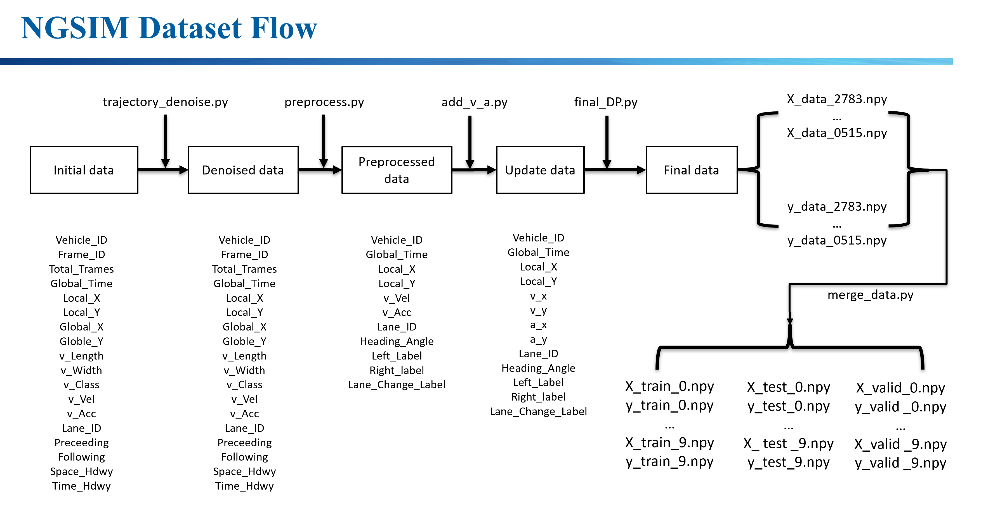
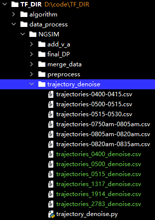
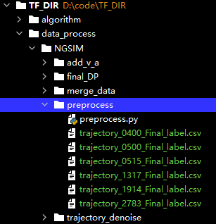
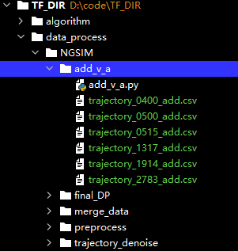
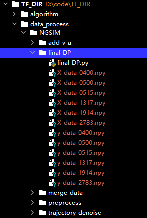

# MTF-LSTM

## Introduction
It's the code of paper "Vehicle Trajectory Prediction Based on Mixed Teaching Force Long Short-term Memory", which is implement in PyTorch.

## Package
numpy                         1.23.4
torch                         1.10.1
sklearn                       0.0
scikit-learn                  0.24.2

## Data Process
The dataset used in this paper is NGSIM US101 and I-80 section data.
We offer the raw data, processed data and trained models in the Baidu Cloud Disk: https://pan.baidu.com/s/17j0gR-vVW2chDv0JAZlJZQ 
Extraction code: xklg

### NGSIM data processing
The NGSIM data processing flow is shown in the following figures:

Step 1: Trajectory Denoising, Put the US101 and I-80 raw data into the following folder and run "trajectory_denoise.py".

Step 2: Filter features, run "preprocess.py".

Step 3: Add new features, run "add_v_a.py".

Step 4: Extract the required 8s track sequence according to the sliding window method, run "final_DP.py".

Step 5: Final consolidation of US101 and I-80 datasets. In order to ensure the data balance and make full use of the dataset, 10 groups of datasets are randomly sampled, and each group is divided into training set, test set and verification set according to the ratio of 6:2:2, run "merge_data.py".

## Model training and testing

MTF-LSTM model training, run "MTF-LSTM.py"

MTF-LSTM-SP model training, run"MTF-LSTM-SP.py"

The trained MTF-LSTM and MTF-LSTM-SP models in this paper are saved in the folder /algorithm/models, which can be run directly to see the training effect of the model.
You can run directly to see the training effect of the model. In view of the large storage space, you can put it into the cloud disk and download it through the above link.

## Citation of papers

Huazhen. Fang, Li. Liu, Xiaofeng. Xiao, Qing. Gu, and Yu. Meng, “Vehicle trajectory prediction based on mixed teaching force long short-term memory,”Journal of Transportation Systems Engineering and Information Technology, vol. 23, no. 04, pp. 80–87, 2023.

DOI: 10.16097/j.cnki.1009-6744.2023.04.009

## Postscript

If you hava any question, please feel free to contact the email fhz_colin@xs.ustb.edu.cn.
